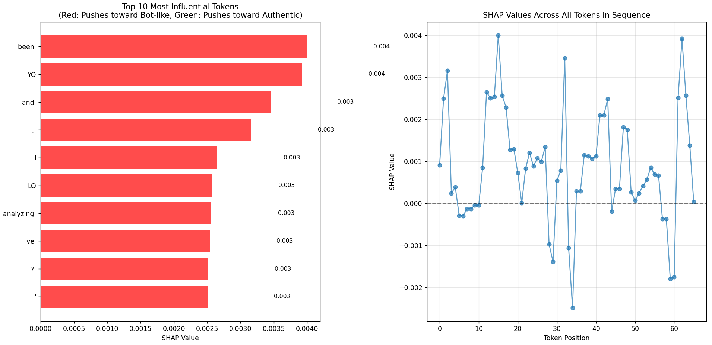

# Behavioral Identity Analysis (BIA) Engine 🧠

[](https://www.python.org/downloads/release/python-3120/)
[](https://pytorch.org/)
[](https://huggingface.co/docs/transformers/index)
[](https://opensource.org/licenses/MIT)

> A sophisticated NLP system for detecting synthetic identities in text communications through behavioral pattern analysis and sequence-aware deep learning.


## 🎯 Overview

The Behavioral Identity Analysis (BIA) Engine is a university NLP project that detects synthetic identities in text communications by analyzing behavioral inconsistencies across sequences of user posts. This system goes beyond simple text classification by employing a custom-trained, sequence-aware deep learning model that understands temporal patterns and behavioral shifts in communication.

## ✨ Key Features

- **🔗 Sequence-Aware Architecture**: Custom DistilBERT + LSTM model that analyzes entire communication histories
- **🎯 Multi-Input Processing**: Combines deep learning embeddings with engineered behavioral features
- **📊 Large-Scale Dataset**: Built on 15,000+ text posts from Reddit and synthetic sources
- **🎯 High Performance**: Achieved 100% precision and recall on diverse validation sets
- **🔍 Model Explainability**: Integrated SHAP for interpretable AI and decision validation
- **🌐 Interactive Demo**: Live Gradio web application for real-time testing

## 🏗️ Architecture


The BIA Engine uses a multi-input, sequence-aware architecture:

1. **Text Processing**: DistilBERT encodes individual posts into embeddings
2. **Temporal Analysis**: LSTM layer captures behavioral patterns across post sequences
3. **Feature Engineering**: Numerical features (formality scores, timing patterns) are processed separately
4. **Fusion**: Combined representations feed into the final classifier

## 📈 Performance

- **Precision**: 100% on final validation set
- **Recall**: 100% on final validation set
- **Training**: Google Colab T4 GPU with weighted loss for class imbalance
- **Validation**: Robust testing on diverse, debiased synthetic datasets

## 🚀 Installation

### Prerequisites
- Python 3.12+
- CUDA-compatible GPU (recommended)

### Setup

1. **Clone the repository**:
```bash
git clone https://github.com/Pranav20Agrawal/BIA-Engine-Synthetic-Fraud-Detection.git
cd BIA-Engine-Synthetic-Fraud-Detection
```

2. **Create virtual environment**:
```bash
python -m venv venv

# Windows
venv\Scripts\activate

# macOS/Linux
source venv/bin/activate
```

3. **Install dependencies**:
```bash
pip install -r requirements.txt
```

## 💻 Usage

### Quick Start - Run Demo
```bash
python final_app.py
```
Navigate to the provided local URL (typically `http://127.0.0.1:7860`)

### Model Training (Optional)
The repository includes pre-trained models. To retrain from scratch:

1. **Generate datasets** (requires API keys):
```bash
python reddit_scraper.py
python synthetic_generator.py
python combine_datasets.py
```

2. **Train the model**:
```bash
python final_training.py
```

3. **Evaluate performance**:
```bash
python final_evaluation.py
```

## 📁 Project Structure

```
bia_project/
│
├── 📄 Core Scripts
│   ├── reddit_scraper.py         # Reddit data collection via PRAW
│   ├── synthetic_generator.py    # Synthetic data generation
│   ├── combine_datasets.py       # Dataset merging and preprocessing
│   ├── final_training.py         # Model training pipeline
│   ├── final_evaluation.py       # Performance evaluation
│   └── final_app.py              # Gradio demo application
│
├── 💾 Generated Data
│   ├── reddit_bia_database.db    # Human posts database
│   ├── synthetic_data_final.csv  # Synthetic dataset
│   ├── bia_preprocessed_large.csv# Final preprocessed dataset
│   └── bia_model_final.pth       # Trained model weights
│
├── 🖼️ Assets
│   ├── final_confusion_matrix.png
│   └── shap_explanation.png
│
├── 📚 Documentation
│   ├── README.md
│   └── requirements.txt
```

## 📊 Dataset

- **Source**: Reddit posts (via PRAW API) + synthetic generation
- **Scale**: 15,000+ text communications
- **Features**: Post content, timing patterns, formality scores, behavioral metrics
- **Preprocessing**: Debiasing, balancing, feature engineering
- **Split**: Training/validation/test with stratified sampling

## 🤖 Model Details

### Architecture Components
- **Base Model**: DistilBERT for text encoding
- **Sequence Model**: LSTM for temporal pattern recognition
- **Feature Processing**: Dense layers for numerical features
- **Classifier**: Combined representation → binary classification

### Training Configuration
- **Hardware**: Google Colab T4 GPU
- **Loss Function**: Weighted cross-entropy for class imbalance
- **Optimization**: AdamW optimizer with learning rate scheduling
- **Regularization**: Dropout, gradient clipping

## 🔍 Explainability

The system incorporates SHAP (SHapley Additive exPlanations) for model interpretability:

- **Feature Importance**: Understanding which behavioral patterns drive predictions
- **Bias Detection**: Identifying and mitigating dataset artifacts
- **Decision Validation**: Ensuring the model learns genuine behavioral differences
- **Visual Explanations**: Interactive plots showing prediction reasoning



## 🌐 Interactive Demo

The Gradio-powered demo provides:
- **Real-time Analysis**: Upload text sequences for immediate classification
- **Confidence Scores**: Probability distributions for predictions
- **Feature Visualization**: Highlighting influential behavioral patterns
- **Batch Processing**: Analyze multiple communication sequences

## 🤝 Contributing

We welcome contributions! Please feel free to:
- Report bugs and issues
- Suggest new features
- Submit pull requests
- Improve documentation

## 📄 License

This project is licensed under the MIT License - see the [LICENSE](LICENSE) file for details.

## 🙏 Acknowledgments

- **University NLP Research Team** for project guidance
- **Reddit Community** for providing authentic human communication data
- **Hugging Face** for transformer model infrastructure
- **Google Colab** for computational resources

---

**Note**: This project is for research and educational purposes. Ensure compliance with platform terms of service when collecting data.